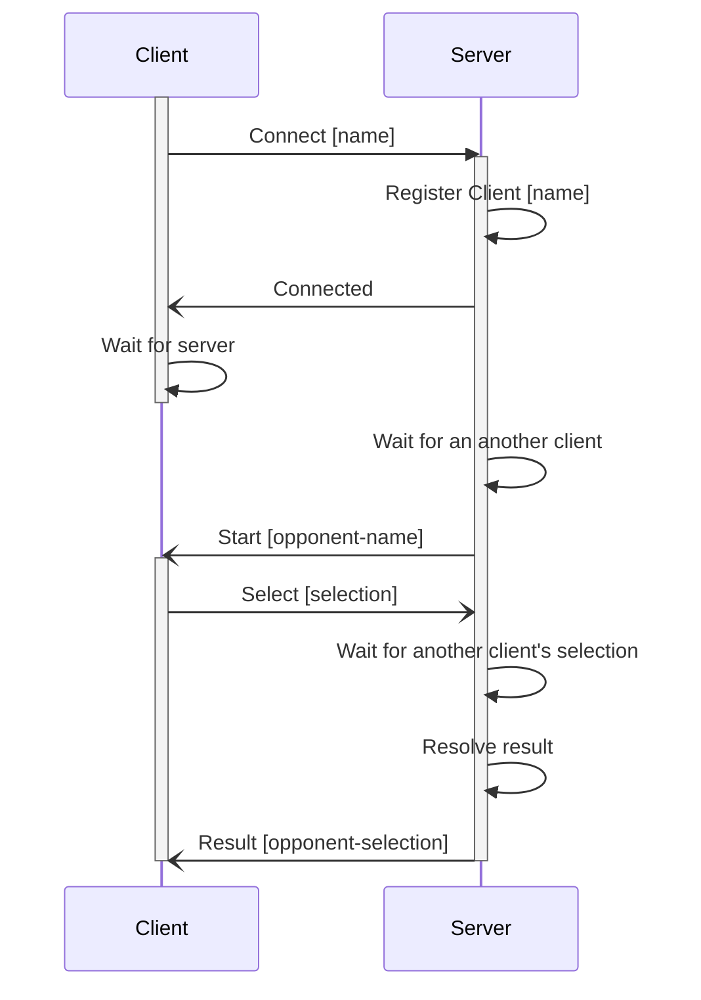

# go-rps

A text-based rock-paper-scissors game with a client-server architecture.

## Features

This section lists the major and minor features of the solution.

- Client-server communication is based on the TCP sockets.
- TCP socket connection configuration can be given as command line arguments.
- Client allows user to provide a player name.

## Build

Use the following scripts to build the applications.

| OS      | Script              |
| ------- | ------------------- |
| Windows | ./scripts/build.bat |
| Linux   | ./scripts/build.sh  |

Successful build binaries will be added into the ./bin folder.

## Unit Test

Use the following scripts to run unit tests for the application.

| OS      | Script                  |
| ------- | ----------------------- |
| Windows | ./scripts/unit-test.bat |
| Linux   | ./scripts/unit-test.sh  |

These scripts will also check that code coverage is within the threshold.

## Game Sequence

This section describes how the gaming sequence works.

